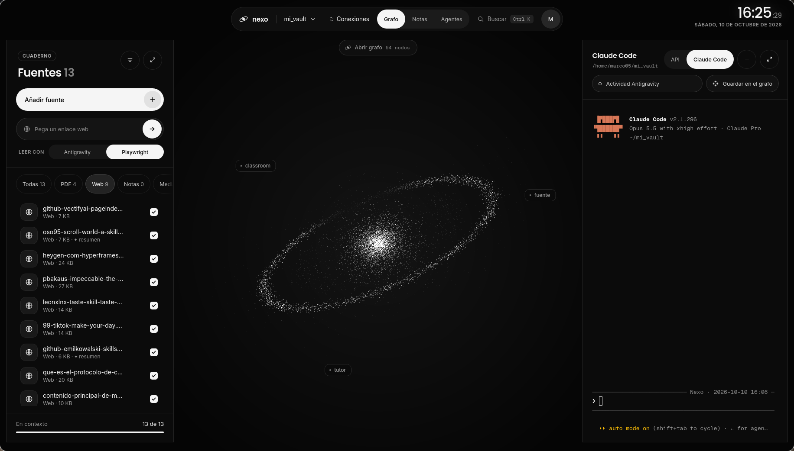

# nexo

[](https://github.com/MarcoAle05/Nexo/actions/workflows/ci.yml)

Un «NotebookLM propio» de escritorio: vuelcas tus fuentes en un vault de Obsidian y Claude las organiza en una wiki enlazada que exploras como grafo, consultas y amplías con tus notas.



## Funciones

- **Fuentes.** PDF, Office, EPUB, Markdown y páginas web. MarkItDown las convierte a Markdown en tu equipo, sin IA, y cada una tiene su ficha con resumen e ideas clave.
- **Wiki y grafo.** Claude integra las fuentes en notas atómicas enlazadas con `[[...]]`. El grafo las dibuja como estrellas por tema, con búsqueda, y se actualiza solo cuando algo cambia en el vault.
- **Notas.** Un escritorio de cartas con un editor por bloques al estilo de Notion que guarda Markdown normal dentro del vault.
- **Claude, de dos maneras.** Nexo (la API) compila fuentes, responde preguntas y conversa con la wiki como contexto. Claude Code corre en una terminal real dentro de la app y hace de orquestador.
- **Skills y agentes.** Las skills y los subagentes de Claude Code del vault se ven y se crean desde la app. El registro muestra qué agente gastó qué parte de tu sesión de 5 horas.
- **Lectura de webs.** Antigravity o Playwright leen la página; Claude Code puede usar un Chrome con tus sesiones y pide confirmación antes de cualquier acción con efectos.

Todo vive en archivos Markdown de tu vault (`raw/` → `wiki/` → `output/`), así que lo abres también desde Obsidian.

## Stack

- **Escritorio:** Tauri 2 con backend en Rust.
- **Interfaz:** Vite y JavaScript sin framework; galaxia en WebGL, grafo en canvas con d3-force y d3-zoom, terminal con xterm.js, Markdown con marked y DOMPurify.
- **IA:** la Messages API de Claude, Claude Code y Antigravity como CLI, y los servidores MCP de MarkItDown y Playwright.

## Cómo correrlo

Necesitas Node, Rust y las [dependencias de sistema de Tauri](https://v2.tauri.app/start/prerequisites/).

```bash
npm install
npm run tauri dev          # app de escritorio con recarga en vivo
npm run dev                # solo la interfaz en el navegador (sin comandos de Tauri)
npm run tauri build        # instaladores
```

Para todas las funciones hacen falta además:

- `markitdown-mcp`: `uv tool install --python 3.12 markitdown-mcp`
- `playwright-mcp`: `npm install -g --prefix ~/.local @playwright/mcp` (usa el Google Chrome instalado)
- `claude` (Claude Code) y `agy` (Antigravity) en el `PATH`
- Una clave de API de Anthropic para Nexo, en `ANTHROPIC_API_KEY` o guardada desde la app. Claude Code usa tu suscripción.

Pruebas:

```bash
npm test                                         # interfaz
cargo test -p nexo-core                          # lógica sin Tauri (grafo, commits del vault, rutas)
cargo test -p nexo-mcp                           # servidor MCP (lanza el binario de verdad)
cd src-tauri
cargo test --no-default-features                 # backend
cargo test --no-default-features -- --ignored    # integración (usan markitdown-mcp y ~/.claude reales)
cargo fmt --check
```

El grafo de la wiki se prueba con casos dorados (`crates/nexo-core/tests/fixtures/grafo/`); sus reglas están en [docs/spec-grafo.md](docs/spec-grafo.md).

Solo se ha probado en Linux (WebKitGTK sobre Wayland). La arquitectura y las decisiones que no se ven a simple vista están en [CLAUDE.md](CLAUDE.md).

## Usar Nexo desde otros agentes (MCP)

`nexo-mcp` es un servidor MCP de solo lectura sobre tu vault: cualquier cliente (Claude Code, Antigravity u otro) puede listar, leer y buscar notas y recorrer el grafo sin abrir la app. No necesita las dependencias de Tauri.

```bash
cargo build --release -p nexo-mcp
claude mcp add nexo -- /ruta/a/nexo-mcp --vault /ruta/a/tu/vault
```

El binario queda en `src-tauri/target/release/nexo-mcp`. Las seis herramientas y sus reglas están en [docs/spec-mcp.md](docs/spec-mcp.md).

## Licencia

[MIT](LICENSE). Las skills de diseño de `.claude/skills/` son de terceros y conservan su licencia: [Impeccable](https://github.com/pbakaus/impeccable) (Apache-2.0) y [taste-skill](https://github.com/Leonxlnx/taste-skill) (MIT), con sus textos en [`licenses/`](licenses/).
